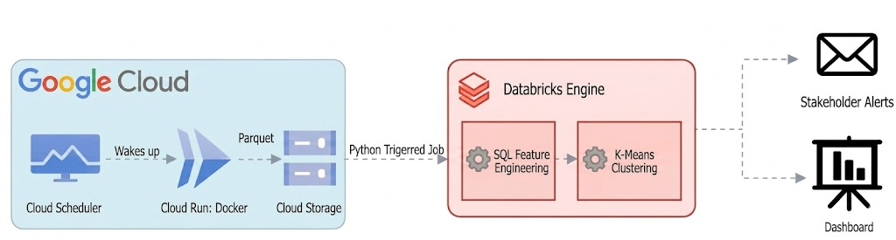
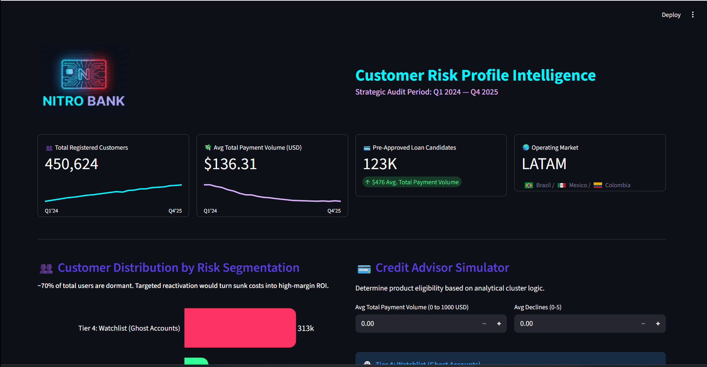
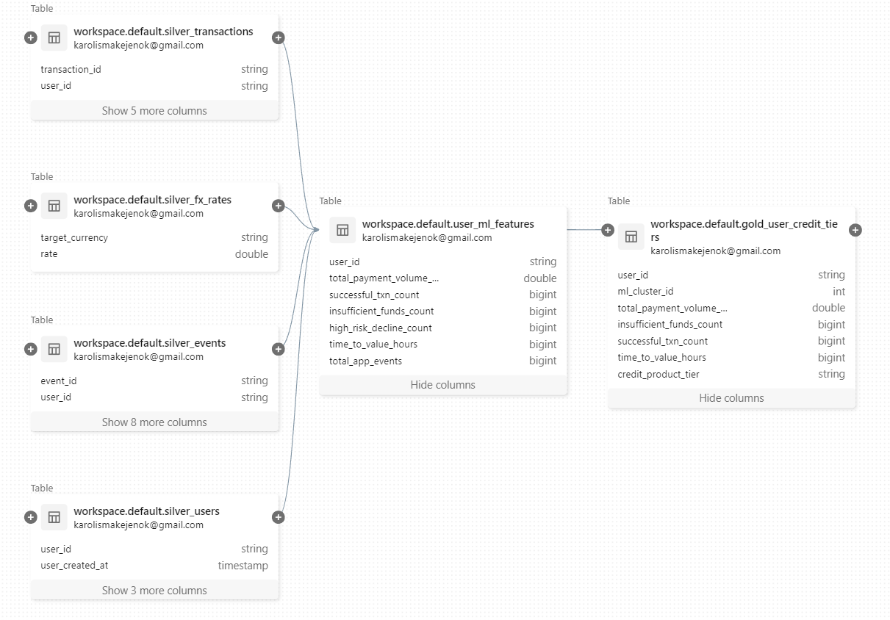

**NOTE:** This is a comprehensive portfolio project utilizing a simulated enterprise dataset. The metrics, company names, and financial figures were constructed to demonstrate production-grade Analytics Engineering, Medallion Architecture, and business-focused data modeling.

# 🏦 NitroBank: Automated Microcredit Pipeline

### The Business Opportunity
NitroBank is expanding its services across LATAM by introducing **Nitro Reserve**—contextual microcredit offerings in Brazil, Mexico, and Colombia. Initial analysis of over **145k regional transactions** revealed a massive opportunity: of the **15.3k declined transactions**, a staggering **89.2%** failed strictly due to **Insufficient Funds**. By bridging these liquidity gaps with real-time micro-loans, we transform moments of customer friction into loyalty-building events.

### The Strategic Challenge
While reacting to checkout failures is highly profitable, scaling a true enterprise credit product requires evaluating the financial health of the **entire** customer base, not just reacting to drop-offs.

### The Business Impact and Engineering Solution 
To enable safe, enterprise-scale credit expansion, I engineered a **fully automated Medallion data pipeline** to evaluate all **450k+ customers**. By processing over **1.62 million raw web events**, the pipeline feeds clean, point-in-time financial features into an **unsupervised K-Means clustering model (k=4)**. 

The model segments registered users into **four stable, business-ready product tiers**. It safely isolates **NitroBank's** top **~124k High-Value users** (spanning both 'Prime' and 'Apex' tiers) for proactive credit offers, while mathematically filtering out over **313k ghost accounts** and protecting against anomalous high-risk profiles. Furthermore, the pipeline orchestrates its own reporting, delivering self-updating dashboards directly to the credit and product teams, completely **eliminating the manual toil** of risk assessments.

### ROI and Business Value through Strategic Segmentation

*   **Tier 1: Apex Wallet (Whales & VIPs) | ~56.6k Users | Avg TPV: $766.37**
    *   **Profile:** High-volume spenders mathematically isolated by top-tier transaction activity.
    *   **Business ROI:** Maximizes Customer Lifetime Value (LTV) by proactively unlocking premium, high-limit credit lines for the platform's most lucrative demographic.
*   **Tier 2: Prime Wallet (Healthy Base) | ~67.4k Users | Avg TPV: $263.69**
    *   **Profile:** The reliable, standard-spend user base driving the majority of consistent platform activity.
    *   **Business ROI:** Serves as the core profit engine for standard credit offerings, ensuring predictable top-line growth.
*   **Tier 3: Nitro Reserve (Micro-Loan Candidates) | ~13.4k Users | Avg TPV: $19.46**
    *   **Profile:** High-intent users hitting "liquidity walls" (identified by low TPV and high decline ratios).
    *   **Business ROI:** Deploying instant, point-of-sale micro-loans directly recovers abandoned checkout revenue and bridges temporary liquidity gaps.
*   **Tier 4: The Reactivation Engine (Ghost Accounts) | ~313.1k Users | Avg TPV: $0.00**
    *   **Profile:** Dormant users who have cleared initial KYC and onboarding but remain inactive.
    *   **Business ROI: CAC Arbitrage.** With neobanking Customer Acquisition Costs (CAC) at a premium, this cohort represents significant sunk investment. Isolating this segment allows marketing to deploy targeted reactivation triggers (e.g., pre-approved micro-limits), generating high-margin LTV without the expense of net-new acquisition.

---

## Technical Implementation

### Decoupled Cross-Cloud Ingestion Architecture
To ensure the ML model evaluates customers based on up-to-date economic conditions, this decoupled ingestion pipeline bridges Google Cloud and Databricks.

*   **Scheduled Containerized Ingestion:** A Dockerized Google Cloud Run instance triggers via GCP Cloud Scheduler to fetch and write compressed `.parquet` payloads to Cloud Storage.
*   **Event-Driven Orchestration:** A Python-triggered workflow initiates the Databricks Engine upon data arrival, ensuring zero idle compute time.
*   **Data Integrity & Schema Validation:** Pydantic enforces strict API contracts to "fail fast" on invalid payloads, protecting downstream integrity.

### Distributed Feature Engineering

To provide PySpark with high-fidelity, one-row-per-user inputs, I pre-aggregated key behavioral KPIs:

*   **Dynamic FX Normalization:** Deduplicated FX payloads and joined point-in-time exchange rates to ensure equitable cross-border credit evaluation.
*   **Risk vs. Liquidity Profiling:** Utilized `COUNT_IF` to isolate users exhibiting "liquidity wall" friction from those showing fraudulent decline patterns.
*   **Behavioral Trust Signals:** Calculated `time_to_value_hours` to mathematically proxy user intent and platform reliance.
*   **Dimensionality Normalization:** Scaled features to ensure massive transaction volumes did not overpower nuanced behavioral signals (like decline velocity).

### Real-Time BI & Executive Serving Layer
*   **Streamlit Serving Layer:** Built an interactive application to democratize ML outputs for non-technical stakeholders.
*   **Unified Gold Layer:** Connected directly to **Databricks Delta** tables for a live pulse of portfolio tier distributions.
*   **Operationalized Intelligence:** Engineered a **Credit Advisor Simulator** that evaluates new customer eligibility in real-time, bridging the gap between raw data and business decisions.

---

## Engineering for Resilience & Scale

### 1. Pragmatic Portfolio UX vs. Live Lakehouse Connections

**The Challenge:** In production, the application dynamically queries Databricks Delta Gold tables. However, direct cloud connections introduce query latency, and Streamlit Cloud hibernates inactive apps after 7 days—risking a slow, poor first impression for reviewing hiring managers.

**The Solution Architecture:**

1. **Data Layer Decoupling:** Isolated the portfolio presentation layer using a local data snapshot wrapper (`USE_CSV_MODE = True`). This eliminates cloud database fetch latency and guarantees a **sub-3-second rendering speed**.
2. **Automated Maintenance Loop:** Engineered a serverless GitHub Actions CI/CD workflow (`keep_alive.yml`) driven by a scheduled cron job.
3. **Container Warmth Orchestration:** Programmatically pings the public deployment endpoint every 3 days to completely reset Streamlit Cloud's inactivity timer, ensuring instant responsiveness for recruiters.
4. **Codebase Integrity:** Preserved all live, production-ready Databricks integration and execution logic within the codebase for architectural documentation.

### 2. Deterministic Labeling of Stochastic Outputs
*   **The Challenge:** K-Means cluster IDs (0, 1, 2) are non-deterministic and shuffle between runs, breaking downstream logic.
*   **The Solution:** Engineered a dynamic profiling step to calculate mathematical centroids. By evaluating these against business guardrails (e.g., TPV thresholds), the pipeline automatically translates random IDs into stable, business-ready labels.

### 3. Mitigating Macroeconomic Drift
*   **The Challenge:** Rapid inflation in LATAM can artificially inflate TPV, causing "concept drift" and incorrectly promoting users to high-risk credit tiers.
*   **The Solution:** Integrating a **rolling 30-day macroeconomic index** into the Silver Layer to normalize TPV *before* it reaches the ML model, ensuring the system maintains accurate risk profiles regardless of market volatility.

### 4. Optimized Compute via Pre-Aggregation
*   **The Challenge:** Direct joins between `users` and high-velocity `events` created a Cartesian "fan-out," ballooning compute costs.
*   **The Solution:** Refactored the architecture using CTEs to pre-aggregate metrics. Decoupled this into a scheduled job materializing a `user_ml_features` table, eliminating the fan-out and significantly reducing OpEx.
