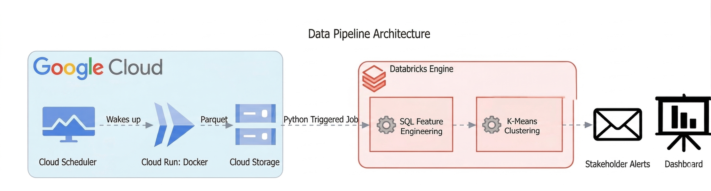

# 🏦 NitroBank: Automated Microcredit Pipeline

## Executive Summary
NitroBank is expanding its LATAM services across Brazil, Mexico, and Colombia by introducing contextual microcredits. Initial analysis of over **145k regional transactions** revealed a massive opportunity: of the **15.3k declined transactions**, a staggering **89.2%** failed strictly due to Insufficient Funds. By bridging these liquidity gaps with real-time micro-loans, we transform moments of customer friction into loyalty-building events.

However, because the financial integrity of the bank is paramount, this initiative required moving beyond isolated transactions. To launch this product responsibly, I engineered a **fully automated pipeline** and **K-Means clustering model** to evaluate the financial health of our **450k** customers. This architecture delivers dual business impact: First, it automatically **segments users into actionable tiers**, empowering the product team to confidently offer micro-loans while protecting the bank from ghost accounts. Second, the pipeline orchestrates its own reporting, **eliminating hours of manual data extraction** by delivering self-updating dashboards and targeted lead lists directly to credit stakeholders.

---

## Data Pipeline Architecture

---

## Technical Implementation & Business Value

### Phase 1 & 2: Data Ingestion & Cross-Cloud Bridge
To ensure the ML model evaluates customers based on accurate, real-time economic conditions, the pipeline automatically ingests daily regional FX rates.
* **Secure Cross-Cloud Integration:** Built a programmatic bridge extracting data from Google Cloud Storage into a Databricks environment without exposing sensitive credentials.
* **Data Integrity:** Enforced strict API schemas using Pydantic, causing the pipeline to "fail fast" on invalid payloads to prevent corrupted data from entering the bank's ecosystem.

### Phase 3: Feature Engineering (Silver Layer)
Raw transaction data was refined into a unified Machine Learning Feature Store, utilizing Spark's distributed query engine for high-speed processing.
* **Behavioral Trust Signals:** Transformed raw timestamps into actionable metrics (like `time_to_value_hours`) to gauge user intent and platform reliance.
* **Optimized Compute:** Replaced heavy, traditional SQL logic with high-performance filtering, drastically reducing the compute cost required to process hundreds of thousands of rows.

### Phase 4: K-Means Clustering & Strategic Value
Relying on manual credit checks for micro-loans is too slow to catch a user at the checkout screen. We applied an unsupervised **K-Means model (k=4)** to mathematically isolate distinct user tiers without human bias.

* **Risk Mitigation:** The algorithm successfully identified and filtered out high-risk profiles, protecting the bank's assets from dormant "Ghost Accounts" and chronic defaulters.
* **Targeted Revenue Generation:** The model pinpointed **1,533 "Nitro Reserve" candidates**. These are not just users who lack funds; they are highly engaged customers who average 4 "Insufficient Funds" declines but possess strong financial recovery signals. 
* **Algorithmic Fairness:** Data scaling ensured that users with massive Total Payment Volumes did not mathematically overpower vital, subtle behavioral metrics, ensuring fair credit evaluation across all income brackets.

### Phase 5: Production Orchestration
Packaged the analytical models into a hands-off, production-grade data product.
* **Event-Driven Automation:** Orchestrated the end-to-end pipeline using Databricks Workflows, triggered immediately upon new data arrival in GCS.
* **NitroBank Reserve:** The final ML outputs feed directly into the **NitroBank Reserve**, a production-ready repository that provides the product and credit teams with a daily, actionable VIP list of the top micro-loan candidates.
