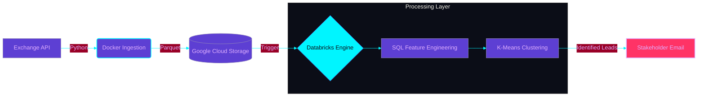

# 🏦 NitroBank: Automated Microcredit Pipeline

##  Executive Summary 

## Executive Summary
NitroBank is expanding its LATAM services across Brazil, Mexico, and Colombia by introducing contextual microcredits. Initial analysis of over **145k regional transactions** revealed a massive opportunity: of the **15.3k declined transactions**, a staggering **89.2%** failed strictly due to Insufficient Funds. By bridging these liquidity gaps with real-time micro-loans, we transform moments of customer friction into loyalty-building events.

However, because the financial integrity of the bank is paramount, this initiative required moving beyond isolated transactions. To launch this product responsibly, I engineered a **fully automated pipeline** and **K-Means clustering model** to evaluate the financial health of our **450k** customers. This architecture delivers dual business impact: First, it automatically **segments users into actionable tiers**, empowering the product team to confidently offer micro-loans while protecting the bank from ghost accounts. Second, the pipeline orchestrates its own reporting, eliminating hours of manual data extraction by delivering self-updating dashboards and targeted CSV lead lists directly to marketing and credit stakeholders daily.

By orchestrating the ingestion of daily exchange rates, enforcing strict data contracts, and leveraging a Medallion Architecture, this pipeline ensures downstream K-Means clustering models are fed with audit-grade, chronologically accurate financial data.

##  Architecture Flow

### Phase 1: Bronze Layer (Ingestion Engine)
Securely extracted, validated, and loaded daily FX rates into the Cloud Data Lake.
* **Data Contracts (Pydantic):** Enforced strict API schemas, failing fast on invalid payloads to prevent downstream data corruption.
* **Columnar Optimization (Parquet):** Converted raw JSON to `.parquet` format to reduce Databricks compute costs and accelerate downstream SQL `MERGE` operations.
* **IAM Security (GCP):** Managed programmatic access to the data lake via a strictly scoped Service Account, isolating all credentials from version control.

### Phase 2: Bronze Layer (Cross-Cloud Ingestion)
Engineered a programmatic cross-cloud bridge to ingest daily data from Google Cloud Storage into an AWS-hosted Databricks environment.
* **SDK Side-Door:** Bypassed Serverless UI restrictions by utilizing the `google-cloud-storage` Python SDK for direct, secure memory extraction.
* **Delta Lake Landing:** Raw Parquet files are immediately converted into Databricks Delta tables, creating an ACID-compliant, version-controlled foundation.

### Phase 3: Silver Layer (Feature Store Engineering)
Transitioned to Databricks SQL to leverage Spark's distributed query engine, transforming raw tables into a unified Machine Learning Feature Store.
* **Exact Deduplication:** Applied Window Functions (`QUALIFY ROW_NUMBER`) to ensure downstream currency normalization strictly uses the most recent exchange rates.
* **Optimized Aggregations:** Replaced standard `CASE WHEN` logic with high-performance `COUNT_IF` and `FILTER` clauses to process hundreds of thousands of rows efficiently.
* **Behavioral Signals:** Engineered critical trust metrics, translating raw timestamps into `time_to_value_hours` to gauge user intent.

### Phase 4: Gold Layer (ML Clustering & Business Logic)
Applied PySpark MLlib to segment over 450,000 customers into actionable financial profiles without human bias.
* **Algorithmic Fairness:** Utilized `VectorAssembler` and `StandardScaler` to prevent massive Total Payment Volumes from overpowering vital, low-integer behavioral metrics (like transaction decline counts).
* **K-Means Segmentation:** Trained an unsupervised K-Means model (k=4) that mathematically isolated four distinct user tiers.
* **Impact Mapping:** Mapped raw ML clusters back to SQL business tiers, successfully isolating **1,533 "Nitro Reserve" candidates**—highly engaged users averaging 4 "Insufficient Funds" declines who represent the immediate target market for micro-loans.

### Phase 5: Production Orchestration
Packaged the analytical models into a production-grade data product.
* **Automated Workflows:** Orchestrated the end-to-end Python, PySpark, and SQL pipeline using Databricks Workflows for hands-off nightly execution.
* **Stakeholder Dashboards:** The final Gold tables feed a live Databricks SQL Dashboard, providing the product team with an automatically updating VIP list of the top 100 highest-priority credit leads.
