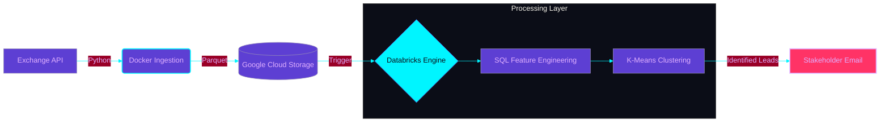

# 🏦 NitroBank: Automated Microcredit Pipeline

##  Project Overview
As NitroBank expands its microcredit offerings across LATAM, financial integrity is paramount. This project replaces a manual SQL-based currency reconciliation process with a fully automated, cloud-native data pipeline. 

By orchestrating the ingestion of daily exchange rates, enforcing strict data contracts, and leveraging a Medallion Architecture, this pipeline ensures downstream K-Means clustering models are fed with audit-grade, chronologically accurate financial data.

##  Architecture Flow

## Phase 1: The Ingestion Engine (Bronze Layer)

The first phase of the pipeline focuses on securely extracting daily FX rates, validating them, and landing them in the Cloud Data Lake.

###  Key Engineering Decisions
* **Data Contract Enforcement (Pydantic):** Instead of blindly trusting the API payload, the pipeline uses Pydantic to enforce a strict schema. If the API returns invalid data types or unexpected currency codes, the pipeline intentionally fails before corrupting downstream tables.
* **Columnar Optimization (Parquet):** Data is transformed from JSON into `.parquet` format before upload. This columnar storage significantly reduces Databricks compute costs and speeds up downstream SQL `MERGE` operations compared to standard CSVs.
* **Security & IAM (Google Cloud):** Programmatic access to the `nitrobank-portfolio` bucket is handled securely via a strictly scoped GCP Service Account. All credential keys and environment variables are isolated and excluded from version control.

